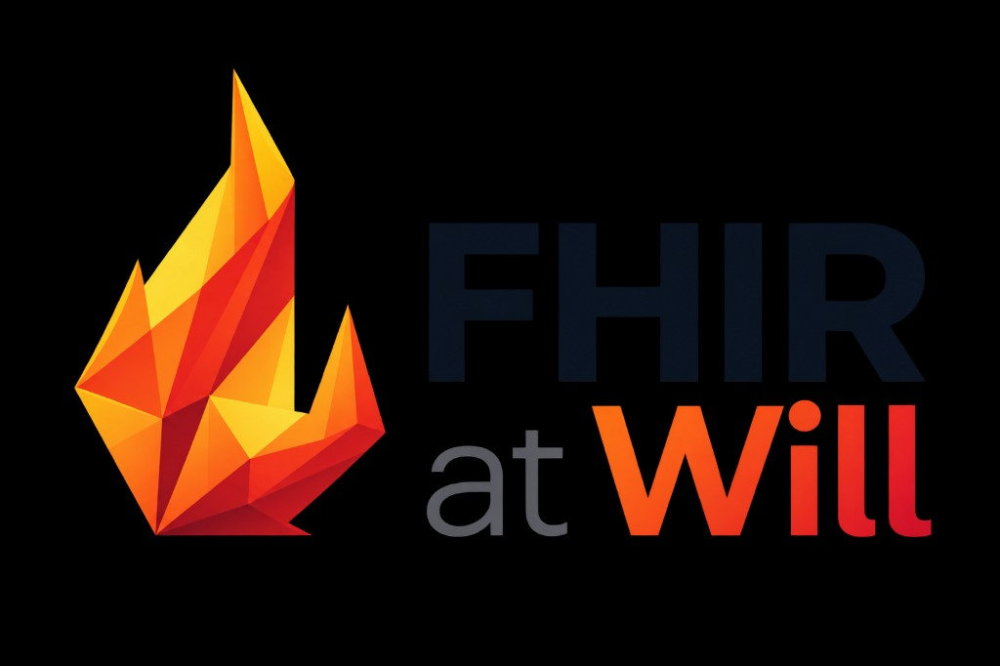
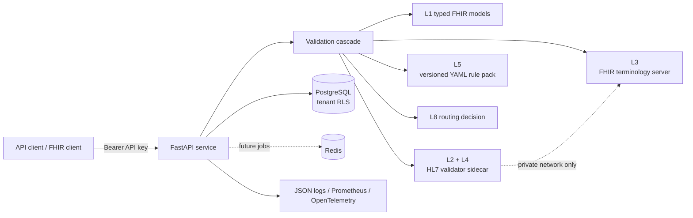

<p align="center">
  
</p>

<p align="center">
  <strong>Verification-first clinical data tooling for FHIR R4.</strong><br>
  Open source · self-hostable · implementation-guide aware · designed for BYOK/BYOM
</p>

# FHIR at Will

**FHIR at Will** is the project; **`fhirbridge`** is its Python package and HTTP service.
Its long-term goal is to turn clinical narrative into validated, provenance-tagged
[FHIR R4](https://hl7.org/fhir/R4/) resources while letting operators bring their own
model and credentials.

The important part is not the model call. It is the harness around it:

- validate structure, profiles, terminology and invariants;
- detect clinically impossible values that valid JSON and FHIR schemas cannot catch;
- disclose every skipped or inconclusive check;
- route uncertain output to review instead of silently accepting it;
- preserve enough version information to reproduce a verdict later; and
- fail closed when a dependency needed to verify the result is unavailable.

> [!IMPORTANT]
> The repository currently implements the platform skeleton and validation service
> (**M0–M1**). Narrative extraction and LLM calls are intentionally not implemented yet.
> The project follows a simple rule: **you cannot build a trustworthy generator before
> you can measure one.**

## What works today

`POST /v1/validate` accepts a FHIR resource or Bundle and returns a structured validation
report. The default deployment targets:

- FHIR `4.0.1`;
- US Core `hl7.fhir.us.core#9.0.0`;
- HL7 Java validator CLI `6.10.2`; and
- a configurable FHIR terminology server (`https://tx.fhir.org/r4` by default).

Implemented today:

- authenticated validation of a resource or Bundle;
- profile validation against preloaded implementation guides;
- terminology `$validate-code` and ConceptMap `$translate`;
- FHIRPath invariant checks;
- configurable plausibility rules for impossible values, date ordering and dose
  magnitude;
- native JSON reports and FHIR `OperationOutcome` responses;
- a FHIR R4 operation facade at `/fhir/R4`;
- API-key authentication, tenant-aware PostgreSQL storage and enforced row-level
  security checks;
- JSON logging, Prometheus metrics and OpenTelemetry hooks; and
- Docker images for the API and an internal validator sidecar.

Not implemented yet:

- narrative/document ingestion;
- LLM provider calls or BYOK/BYOM routing;
- extraction, assertion, binding, assembly and repair;
- source-to-output fidelity and coverage scoring;
- review queues and delivery workflows; and
- narrative-to-FHIR conversion through `/v1/conversions` or `/fhir/R4/$convert`.

The capability endpoint reports both sides explicitly:

```text
GET /v1/capabilities
```

## The validation cascade

Every report includes all eight layers. A layer that did not run is marked `skipped` or
`not_applicable`; absence is never allowed to look like a pass.

| Layer | Name | What it asks | Current status |
|---:|---|---|---|
| L1 | Structural | Is this a parseable, allowed FHIR R4 resource? | Implemented |
| L2 | Profile | Does it conform to declared/requested profiles? | Implemented |
| L3 | Terminology | Are codes valid and in their bound ValueSets? | Implemented |
| L4 | Invariants | Do the applicable FHIRPath invariants hold? | Implemented |
| L5 | Plausibility | Is the value physiologically or temporally impossible? | Implemented |
| L6 | Fidelity | Is each generated element entailed by source spans? | M3 |
| L7 | Coverage | Which clinical mentions were omitted from the Bundle? | M3 |
| L8 | Routing | Can this auto-accept, or does it need review/rejection? | Implemented for standalone validation |

Two distinctions matter:

1. **Conformant does not mean correct.** A heart rate of `44000 /min` can be valid FHIR
   and still be impossible. L5 exists for that gap.
2. **Abnormal does not mean impossible.** Plausibility rules flag extraction/unit errors,
   not clinical findings that merely deserve medical attention.

## Architecture



The API and database owner are deliberately separate identities. Migrations and
provisioning run as the owner; normal requests run as a least-privileged application role.
PostgreSQL exempts owners, superusers and `BYPASSRLS` roles from row-level security, so
using the owner for the API would make tenant isolation appear configured while silently
disabling it. `/readyz` checks for that condition.

The validator stays on the private service network. It has no authentication and can
fetch resources it is pointed at, so publishing its port would turn it into an unsafe
public service.

## Quick start with Docker

### Prerequisites

- Docker Desktop or Docker Engine with Compose v2;
- at least 4 GB of memory available to the validator build/runtime;
- network access while building the validator image so the pinned IG package can be
  cached; and
- `curl`, Python, or another HTTP client.

### 1. Configure the stack

Create a local environment file:

```bash
# macOS / Linux
cp .env.example .env
```

```powershell
# Windows PowerShell
Copy-Item .env.example .env
```

At minimum, replace these development passwords in `.env`:

```dotenv
POSTGRES_PASSWORD=choose-an-owner-password
APP_DB_PASSWORD=choose-a-different-app-password
```

The two passwords serve different roles. The API must use `APP_DB_PASSWORD`, never the
PostgreSQL owner password.

### 2. Migrate and bootstrap

```bash
docker compose --profile setup run --rm bootstrap
```

This one-off command:

1. applies Alembic migrations;
2. creates/grants a least-privileged `fhirbridge_app` role;
3. creates the initial tenant; and
4. prints an API key.

The API key is shown once. Only its Argon2id hash is stored, so a lost key must be
re-issued rather than recovered.

### 3. Start the services

```bash
docker compose up -d
docker compose ps
```

The API is available on `http://localhost:8000`. PostgreSQL, Redis and the validator are
not published to the host by the default Compose file.

### 4. Check readiness

```bash
curl http://localhost:8000/livez
curl http://localhost:8000/readyz
curl http://localhost:8000/version
```

- `/livez` answers whether the API process is alive.
- `/readyz` answers whether PostgreSQL isolation, the validator and terminology service
  are all usable.
- `/version` records the code, FHIR, IG and validator versions behind a verdict.

Readiness returns `503` and identifies the failed dependency rather than claiming the
service can validate without it.

Interactive API documentation is available at:

- `http://localhost:8000/docs`
- `http://localhost:8000/openapi.json`

## Validate a resource

Every compute endpoint requires:

```http
Authorization: Bearer fhirb_...
```

This Python example avoids shell-specific JSON quoting:

```python
import httpx

base_url = "http://localhost:8000"
api_key = "fhirb_..."  # use the value printed by bootstrap

patient = {
    "resourceType": "Patient",
    "id": "example",
    "meta": {
        "profile": [
            "http://hl7.org/fhir/us/core/StructureDefinition/us-core-patient"
        ]
    },
    "name": [{"family": "Shaw", "given": ["Amy"]}],
    "gender": "female",
}

response = httpx.post(
    f"{base_url}/v1/validate",
    headers={"Authorization": f"Bearer {api_key}"},
    json={"resource": patient},
    timeout=180,
)
response.raise_for_status()

report = response.json()
print(report["status"])
print(report["conformant"])
print(report["scores"])
for layer in report["layers"]:
    print(layer["layer_number"], layer["layer"], layer["status"])
```

The example intentionally omits the identifier US Core requires, so a healthy deployment
should return HTTP `200` with a report whose L2 profile layer fails. A non-conformant
resource is a successful validation request, not an HTTP error.

Request options include:

```json
{
  "resource": {"resourceType": "Patient"},
  "profiles": ["http://example.org/StructureDefinition/my-profile"],
  "layers": ["structural", "profile", "terminology"],
  "severity_overrides": {"fb-plaus-heart-rate": "warning"},
  "max_terminology_checks": 500
}
```

A bare FHIR resource is also accepted with `Content-Type: application/fhir+json`.

## API surface

### Public platform endpoints

| Method | Path | Purpose |
|---|---|---|
| `GET` | `/livez` | Process liveness |
| `GET` | `/readyz` | Dependency and RLS readiness |
| `GET` | `/version` | Reproducibility/version pins |
| `GET` | `/metrics` | Prometheus metrics |
| `GET` | `/v1/error-codes` | Error catalogue as a FHIR `CodeSystem` |
| `GET` | `/fhir/R4/metadata` | FHIR `CapabilityStatement` |

### Authenticated validation and discovery

| Method | Path | Purpose |
|---|---|---|
| `GET` | `/v1/health/dependencies` | Detailed dependency status |
| `GET` | `/v1/capabilities` | Implemented and planned capabilities |
| `GET` | `/v1/igs` | Preloaded implementation-guide coordinates |
| `POST` | `/v1/validate` | Native, detailed validation report |
| `POST` | `/v1/validate/outcome` | Same cascade as a FHIR `OperationOutcome` |
| `POST` | `/v1/terminology/validate-code` | Code/ValueSet validation |
| `POST` | `/v1/terminology/map` | ConceptMap `$translate` passthrough |
| `POST` | `/fhir/R4/$validate` | FHIR-native validation operation |

### Defined but intentionally unavailable

These routes return `501` with guidance instead of pretending to work:

- `POST /v1/translate/hl7v2`
- `POST /v1/translate/cda`
- `POST /v1/translate/tabular`
- `POST /fhir/R4/$convert`
- `POST /fhir/R4/$extract`

HL7 v2, C-CDA and tabular conversion have deterministic mapping tools. Using an LLM for
a format with a published grammar would trade correctness for nothing; convert those
formats with an appropriate mapping engine, then submit the result to `/v1/validate`.

## Errors and fail-closed behavior

The API uses two error envelopes:

- platform/request errors use `application/json` with `error.code`, `error.message` and
  `error.trace_id`;
- clinical/dependency errors use a FHIR `OperationOutcome` with a machine-readable code
  under `issue[].details.coding[]`.

Every response includes `X-Request-Id` and `X-Trace-Id`. Dependency failures may include
`Retry-After`.

If the validator or terminology server is unavailable, validation returns `503`; it does
not skip the check and produce a report that looks verified. Similarly, an unknown
profile returns `422 ig-not-loaded` rather than a false clean result.

## Configuration

Common development configuration is documented in [`.env.example`](.env.example). The
settings operators most often need are:

| Variable | Purpose | Development default |
|---|---|---|
| `DATABASE_URL` | Least-privileged async PostgreSQL connection | Required |
| `REDIS_URL` | Redis connection | Required outside Compose |
| `VALIDATOR_URL` | Internal validator sidecar | `http://validator:8081` in Compose |
| `TERMINOLOGY_URL` | FHIR terminology server | `https://tx.fhir.org/r4` |
| `DEFAULT_IG_PACKAGES` | IG coordinates stamped into reports | `hl7.fhir.us.core#9.0.0` |
| `VALIDATOR_VERSION` | Validator version stamped into reports | `6.10.2` |
| `REQUIRE_RLS_ENFORCEMENT` | Refuse readiness if RLS does not apply | `true` |
| `FHIRBRIDGE_ENV` | `development`, `staging`, or `production` | `development` |
| `ALLOW_INSECURE_TRANSPORT` | Allow future `X-LLM-*` credentials over HTTP | `false` |
| `JSON_LOGS` | Structured logging | `true` |

`tx.fhir.org` is useful for development but has no SLA. The service sends terminology
codes, not surrounding resources, but codes can still be sensitive in context. Operate
your own licensed terminology service for a production deployment that needs tighter
availability, privacy or code-system guarantees.

`FHIRBRIDGE_ENV=production` enables additional startup checks. Production mode refuses to
start when:

- `ALLOW_INSECURE_TRANSPORT` or `DEBUG_CAPTURE_LLM_IO` is enabled;
- `FHIRBRIDGE_EPHEMERAL_KEY` is missing;
- `TERMINOLOGY_URL` still points at the public `tx.fhir.org` service; or
- a non-loopback `VALIDATOR_URL` uses plaintext HTTP.

These checks apply even though the LLM pipeline is not implemented yet, so a deployment
cannot enter production with unsafe BYOK defaults waiting to be activated later.

## Security and privacy model

The codebase is designed to make unsafe states visible:

- API keys are stored as Argon2id hashes and presented as Bearer credentials;
- tenant-scoped tables use PostgreSQL row-level security;
- readiness verifies that the connected role is actually subject to RLS;
- submitted `/v1/validate` resources are scored and dropped rather than persisted;
- validation responses use `Cache-Control: no-store`;
- terminology calls use POST bodies, keeping codes out of URLs and common access logs;
- structured logs record decisions and counts, not validator messages that may quote
  clinical values;
- secrets and known sensitive fields pass through centralized redaction; and
- the validator is intended for a private network only.

Self-hosting is not, by itself, HIPAA/GDPR compliance. Operators remain responsible for
transport security, access control, backups, retention, terminology licensing, business
associate/data processing agreements, incident response and the infrastructure on which
the service runs. Do not send real PHI to a third-party terminology or future LLM provider
without the required legal and technical controls.

## Notebook smoke test

[`notebooks/api_smoke_test.ipynb`](notebooks/api_smoke_test.ipynb) exercises a running
deployment end to end. It asserts health, authentication, discovery, every cascade layer
available in M1, terminology, the FHIR facade and both error envelopes.

```bash
uv sync --group notebook
uv run jupyter lab notebooks/api_smoke_test.ipynb
```

Set `FHIRBRIDGE_BASE` and `FHIRBRIDGE_API_KEY`, or enter the key when the notebook prompts.
Use only synthetic resources: notebook outputs are persisted inside the `.ipynb` file.

## Development

Python `3.12` and [`uv`](https://docs.astral.sh/uv/) are the supported development path:

```bash
uv sync
uv run pytest -q -m "not integration"
uv run ruff check .
uv run ruff format --check .
uv run mypy
```

Integration tests use real PostgreSQL/Redis/validator dependencies and require Docker:

```bash
uv run pytest -m integration
```

For environments without `uv`, `uv.lock` is exported to hash-pinned files:

```bash
pip install -r requirements.txt
pip install -r requirements.txt -r requirements-dev.txt
pip install -r requirements.txt -r requirements-notebook.txt
```

`requirements-dev.txt` and `requirements-notebook.txt` contain only their group, so install
them alongside `requirements.txt`. They are generated artifacts; do not edit them by
hand. `tests/contract/test_requirements_export.py` detects drift from `uv.lock`.

## Repository layout

| Path | Contents |
|---|---|
| `src/fhirbridge/api/` | FastAPI app, middleware, auth, schemas and routers |
| `src/fhirbridge/validation/` | Cascade orchestration and report models |
| `src/fhirbridge/validation/rules/` | Versioned L4 invariant and L5 plausibility YAML |
| `src/fhirbridge/fhir/` | Typed models, OperationOutcome and validator client |
| `src/fhirbridge/terminology/` | Terminology server client and result models |
| `src/fhirbridge/storage/` | SQLAlchemy models, tenant sessions, RLS checks and provisioning |
| `src/fhirbridge/observability/` | Logging, redaction, metrics and tracing |
| `alembic/` | Database migrations |
| `docker/api/` | Production API image |
| `docker/validator/` | Pinned validator image and preloaded IG cache |
| `scripts/bootstrap.py` | Migrations support, app-role/tenant/key provisioning |
| `tests/` | Unit, contract, security and integration suites |
| `notebooks/` | Executable API smoke test |
| `assets/` | Project artwork, including the README logo |

## Roadmap

| Milestone | Goal | Status |
|---|---|---|
| M0 | Config, storage, auth, errors, OpenAPI, health, containers | Implemented |
| M1 | Validation cascade, validator sidecar, terminology and plausibility | Implemented |
| M2 | BYOK/BYOM provider gateway and qualification probes | Planned |
| M3 | Narrative ingestion, facts, generation, fidelity and coverage | Planned |
| M4 | Human review workflow | Planned |
| M5 | Model qualification and calibrated routing | Planned |
| M6 | Delivery integrations and operational hardening | Planned |

## Contributing

Keep changes small and verification-first:

1. add or update tests for the behavior;
2. run lint, formatting, types and the relevant test suites;
3. update the OpenAPI contract snapshot when the public contract changes;
4. never log resource bodies, issue messages or credentials; and
5. never turn an unavailable verifier into a successful response.

## License

The Python package declares the [Apache License 2.0](https://www.apache.org/licenses/LICENSE-2.0).
